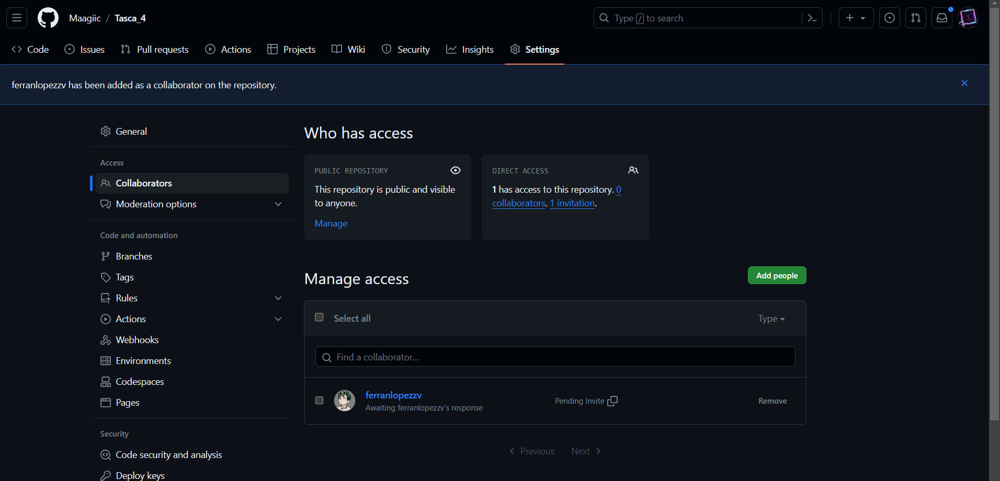
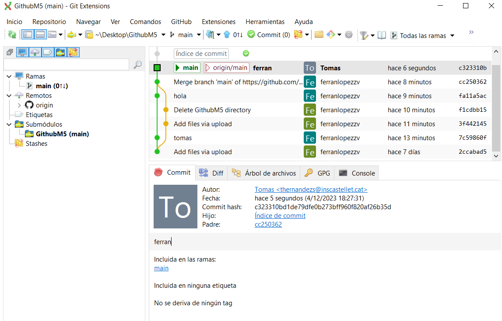

Pasos per Compartir el Repositori:
1. Crear un Repositori a GitHub:
Inicia sessió a GitHub i segueix aquests passos per crear un nou repositori:

Pàgina principal de GitHub -> Repositoris -> Nou Repositori.
Completa la informació requerida i fes clic a "Create repository".

2. Configurar el Repositori Local:
A la teva màquina local, obre la terminal i executa els següents comandaments:

bash
Copy code
# Inicialitza un nou repositori
git init

# Afegeix tots els arxius al repositori
git add .

# Fes un commit inicial
git commit -m "Primer commit"

# Afegeix l'enllaç del teu repositori a GitHub com a remot
git remote add origin URL_DEL_TEU_REPOSITORI

# Puja els canvis al repositori remot a la branca principal
git push -u origin master

3. Compartir l'URL del Repositori:
Copia l'URL del teu repositori a GitHub per compartir-lo amb altres membres de l'equip o col·laboradors.

Com clonar un Repositori amb Git Extensions:

1. Obre Git Extensions:

Inicia l'aplicació Git Extensions des del teu ordinador.
2. Clona el Repositori:

Fes clic a "Clone repository" al menú principal.
3. Completa la Informació del Repositori a Clonar:

Introdueix l'URL del repositori que vols clonar.
Selecciona la carpeta de destinació local on vols clonar el repositori.
4. Configura les Opcions (Opcional):

Si és necessari, pots configurar opcions addicionals com la branca a clonar.
5. Fes clic a "Clone":

Un cop hagis introduït la informació necessària, fes clic a "Clone" per iniciar el procés de clonació.
6. Configura la Connexió amb GitHub (si és necessari):

Es possible que se't demani que introdueixis les teves credencials de GitHub si és un repositori privat.
7. Espera que Finalitzi la Clonació:

Git Extensions clonarà el repositori des de la ubicació indicada a la teva màquina local.
8. Verifica el Repositori Clonat:

Un cop finalitzat el procés, hauries de veure el teu repositori clonat a la interfície de Git Extensions.

